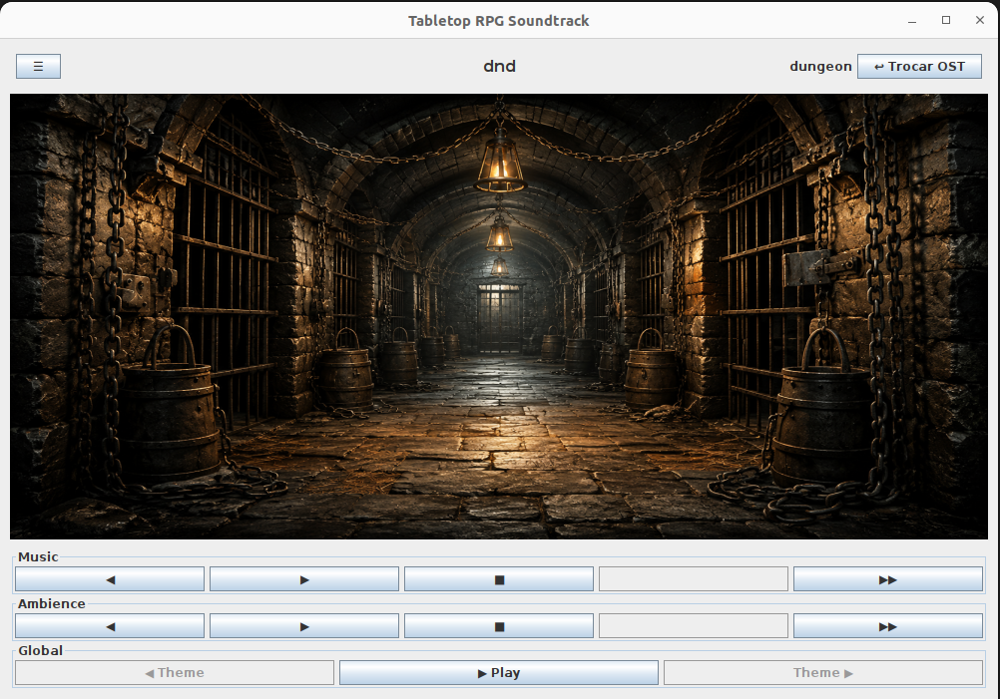

# TableTopOST — Sistema de Ambientação Sonora Simultânea para RPG de Mesa



Player de trilha sonora para mesas de RPG com **dois canais independentes e simultâneos**: música e som ambiente. Organize suas OSTs em campanhas (ex.: `dnd`, `lovecraft`, `iron_kingdoms`) e temas (ex.: `village`, `dungeon`, `asylum`), e controle tudo via terminal (CLI) ou interface gráfica (Swing).

---

## 1. Pré-requisitos

| Requisito | Versão | Obrigatório | Observação |
|---|---|---|---|
| **Java (JDK)** | 21+ | Sim | O projeto compila com `--release 21`. |
| **Maven** | 3.8+ | Sim | Usado para compilar e empacotar o `.jar`. |
| **ffmpeg / ffplay** | qualquer recente | **Sim, no Linux** | É o player de áudio real usado no Linux (veja seção 2). |

> Não é necessário instalar bibliotecas Java extras de áudio — as dependências do projeto (Gson, JLine) já vêm resolvidas automaticamente pelo Maven a partir do `pom.xml`.

## 2. Dependência de áudio

O player de áudio muda de acordo com o sistema operacional:

- **Linux** → o app chama o binário `ffplay` (parte do **ffmpeg**) por linha de comando. **Sem o ffmpeg instalado, não sai som nenhum no Linux.**
- **Windows** → o app usa a API nativa de áudio do Java (`javax.sound.sampled`), sem dependências externas.

⚠️ **Atenção (Windows):** os arquivos de trilha do projeto são `.mp3`, mas a API nativa do Java (`javax.sound.sampled`) só reproduz **WAV/AIFF/AU nativamente**, sem suporte a MP3 out-of-the-box. Se o áudio não tocar no Windows, converta os arquivos de `local_storage/**/songs` e `local_storage/**/ambience` para `.wav`, ou rode o projeto dentro do WSL/Linux com ffmpeg instalado.

### Instalando o ffmpeg (Linux)

```bash
# Debian/Ubuntu
sudo apt update && sudo apt install ffmpeg

# Fedora
sudo dnf install ffmpeg

# Arch
sudo pacman -S ffmpeg
```

Verifique a instalação:

```bash
ffplay -version
```

---

## 3. Instalação e build

```bash
# Entre na pasta do projeto
cd tabletop-rpg-soundtrack

# Compile e gere o .jar executável
mvn clean package
```

O `.jar` gerado fica em `target/tabletop-rpg-soundtrack-0.1.0-SNAPSHOT.jar`.

> **Importante:** o app lê as pastas `local_storage/` e `cache/` como caminhos relativos (`./local_storage`, `./cache`). Sempre execute o `.jar` a partir da **raiz do projeto**, senão ele não encontra as OSTs.

---

## 4. Executando

Existem duas formas de rodar: a partir do `.jar` já compilado (recomendado) ou direto pelo Maven, sem precisar empacotar antes (bom durante o desenvolvimento).

### Opção A — a partir do `.jar` (após `mvn clean package`)

**Interface gráfica (padrão):**
```bash
java -jar target/tabletop-rpg-soundtrack-0.1.0-SNAPSHOT.jar
```

**Modo terminal (CLI):**
```bash
java -jar target/tabletop-rpg-soundtrack-0.1.0-SNAPSHOT.jar --cli
```

### Opção B — direto pelo Maven, sem gerar o `.jar` (`exec:java`)

```bash
mvn exec:java -Dexec.mainClass="br.org.tabletoprpg.soundtrack.Main"
```

Para abrir no modo CLI, passe o argumento normalmente:
```bash
mvn exec:java -Dexec.mainClass="br.org.tabletoprpg.soundtrack.Main" -Dexec.args="--cli"
```

> ⚠️ O `pom.xml` deste projeto **não declara** o `exec-maven-plugin`. Ao rodar `mvn exec:java` pela primeira vez, o Maven vai resolver o prefixo `exec` e **baixar o plugin automaticamente do Maven Central**, então é preciso ter internet nessa primeira execução. Nas próximas, ele já fica em cache local (`~/.m2`).
>
> O argumento `--gui` (ex.: `-Dexec.args="--gui"`) não precisa ser passado: a GUI já é o modo padrão sempre que `--cli`/`cli` não é informado. O código só verifica explicitamente a flag `--cli`.

---

## 5. Comandos do modo CLI

Digite `HELP` a qualquer momento dentro do prompt para ver esta lista.

**Trilha sonora (OST)**
| Comando | Descrição |
|---|---|
| `LIST_OSTS` | Lista as OSTs disponíveis. |
| `SET_OST <nome>` | Seleciona a OST especificada (copia para o cache se necessário). |
| `UNSET_OST` | Desseleciona a OST atual e para a reprodução. |

**Temas**
| Comando | Descrição |
|---|---|
| `LIST_THEMES` | Lista os temas da OST atual. |
| `SET_THEME <nome>` | Seleciona o tema especificado. |
| `UNSET_THEME` | Volta ao tema padrão da OST atual. |
| `GET_CURRENT_THEME` | Mostra o tema atualmente selecionado. |
| `GET_THEME_IMAGES` | Lista as imagens do tema atual. |
| `GET_THEME_IMAGE <index>` | Mostra a imagem do índice informado. |

**Reprodução**
| Comando | Descrição |
|---|---|
| `PLAY_SONG` | Reproduz uma música do tema atual. |
| `PAUSE_SONG` | Pausa a música atual. |
| `NEXT_SONG` / `PREVIOUS_SONG` | Navega entre as músicas do tema. |
| `PLAY_AMBIENCE` | Reproduz o som ambiente do tema atual. |
| `PAUSE_AMBIENCE` | Pausa o som ambiente atual. |
| `NEXT_AMBIENCE` / `PREVIOUS_AMBIENCE` | Navega entre os sons ambiente do tema. |
| `PLAY_BOTH` / `PAUSE_BOTH` | Toca ou pausa música e ambiente juntos. |

**Sistema**
| Comando | Descrição |
|---|---|
| `STATUS` | Mostra a OST, tema e reprodução atuais. |
| `HELP` | Exibe o menu de ajuda. |
| `CLEAR` | Limpa a tela do terminal. |
| `EXIT` | Sai do aplicativo. |

---

## 6. Estrutura de conteúdo (OSTs)

As OSTs incluídas ficam em `local_storage/`, organizadas assim:

```
local_storage/
└── <ost>/                  # ex.: dnd, lovecraft, iron_kingdoms
    └── <tema>/              # ex.: village, dungeon, asylum
        ├── songs/           # músicas (.mp3 / .wav)
        ├── ambience/        # sons ambiente (.mp3 / .wav)
        └── images/          # imagens do tema (.png/.jpg/.jpeg/.gif/.webp)
```

Para adicionar sua própria OST, crie essa mesma estrutura de pastas dentro de `local_storage/` e depois rode o script auxiliar para gerar o `manifest.json` de cada OST:

```bash
cd local_storage
python3 generate_manifest.py
```

O script exige que cada tema tenha ao menos um arquivo em `songs/`, `ambience/` e `images/` para ser considerado válido.